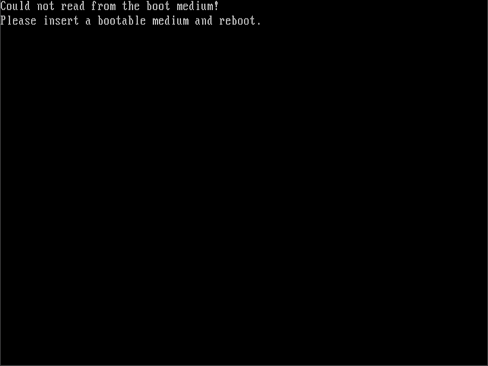
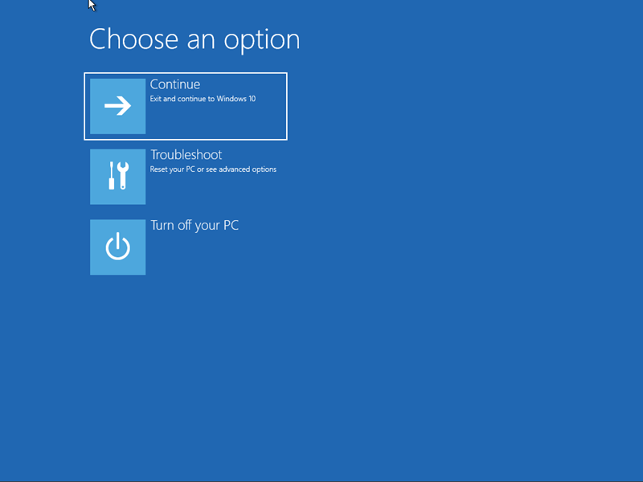
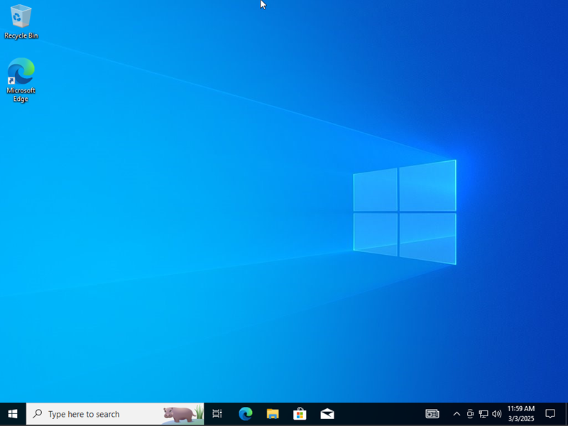

# Troubleshooting a No Boot Issue on Windows 10 VM

## Goal
Simulate and resolve a no-boot scenario on my Windows 10 VM to practice help desk troubleshooting.

## Setup
- Host: Windows 11 PC
- VM: “PC1” (Windows 10, 4GB RAM, 20GB disk)
- Tools: VirtualBox 7.0.12

## Steps
1. Broke the VM:
   - Removed the virtual disk (PC1.vdi) from Storage settings under Controller: SATA.
2. Booted “PC1,” saw error:
   - “Could not read from the boot medium! Please insert a bootable medium and reboot.”—no OS detected.
3. Fixed it:
   - Reattached the disk (PC1.vdi) in Storage under Controller: SATA.
   - Booted to Safe Mode automatically—restarted from Safe Mode to boot normally.
4. Tested:
   - Booted to desktop, ran Notepad and File Explorer—worked fine.

## Outcome
Restored “PC1” to normal booting state—ready for more tests.

## Screenshots
 
 
 

## Summary (Why I Did This)
- Wanted to mimic a help desk call—PC won’t boot due to a missing drive—and fix it with A+ skills.

## Notes (What I Learned)
- Removing the disk caused a clear “No bootable medium” error; reattaching booted to Safe Mode—restarting fixed it in ~10 minutes.
