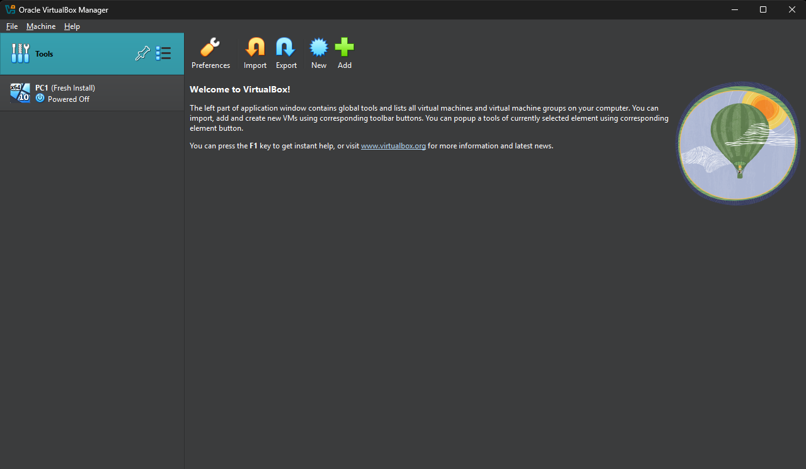

# Setting Up VirtualBox with Windows 10 on Windows 11

## Goal
Deploy a Windows 10 VM on my Windows 11 PC using VirtualBox to create a help desk test environment.

## Setup
- **Host**: Windows 11 PC
- **Tools**: VirtualBox 7.x, Windows 10 ISO (trial version)
- **Specs**: 2GB RAM, 20GB dynamically allocated disk

## Steps
1. **Installed VirtualBox on Windows 11**  
   - Downloaded the Windows installer from virtualbox.org (picked “Windows hosts,” ~100MB file).
   - Double-clicked the .exe to install—no admin needed, ran fine as standard user.
   - Wizard prompted for network adapters (“Oracle VM VirtualBox Networking”)—clicked yes to proceed.
   - Opened VirtualBox from Start menu; blank manager window loaded, no crashes.

2. **Downloaded Windows 10 ISO**  
   - Went to microsoft.com/en-us/software-download/windows10 in Edge.
   - Ran Media Creation Tool: “Download tool now,” picked “ISO file” over USB, chose Windows 10 64-bit.
   - Saved to Downloads (~5GB, took 20 minutes on my Wi-Fi—slower than expected).
   - Checked file size in File Explorer to ensure it downloaded fully.

3. **Created a VM in VirtualBox**  
   - In VirtualBox, hit “New” on the toolbar.
   - Named it “PC1,” set Type to “Microsoft Windows,” Version “Windows 10 (64-bit).”
   - Gave it 2GB RAM—my PC has 64GB total.
   - Set up a 20GB disk: “Create a virtual hard disk now,” VDI type, “Dynamically allocated.”

4. **Configured Storage and Installed Windows 10**  
   - Opened Settings > Storage for “PC1”
   - Under “Controller: IDE,” clicked the disk icon, chose my Windows 10 ISO from Downloads.
   - Started VM—Windows boot screen loaded, picked “Custom: Install Windows only” (skipped key).
   - Install took ~40 minutes; set a basic user with no password for simplicity.

5. **Tested Functionality**  
   - Logged into Windows 10 VM, desktop appeared.
   - Ran Notepad and File Explorer—both opened fast, no lag.
   - Shut down via Start > Power > Shut down to keep it stable for next steps.

## Outcome
Successfully set up a Windows 10 VM, ready for help desk troubleshooting scenarios.

## Screenshots
-  *(Upload pending)*
-  *(Upload pending)*
-  *(Upload pending)*

## Summary
- Wanted a hands-on project to prove my A+ skills—like OS installs and virtualization—for help desk roles.
- Chose VirtualBox on Windows 11 since it’s my main PC, and Windows 10 VMs mimic common user setups I’d support.
- Aimed to build a portfolio piece that shows I can set up test environments, a skill for troubleshooting tickets.

## Notes (What I Learned)
- Had an issue entering windows setup the first time booting. It was trying to boot off the floppy drive 
